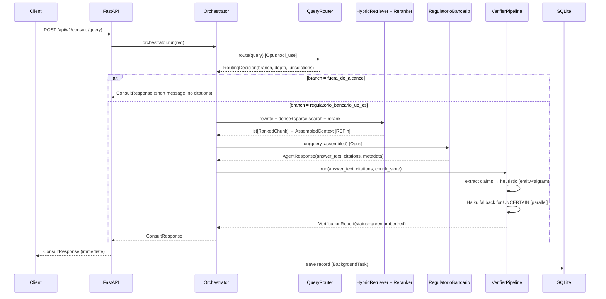

# lex-agents Architecture

## Table of contents

1. [System overview](#system-overview)
2. [Component map](#component-map)
3. [Full pipeline: POST /api/v1/consult](#full-pipeline)
4. [Model selection](#model-selection)
5. [Retrieval: Hybrid Search with RRF](#retrieval)
6. [Verification status policy](#verification-status)
7. [Security model](#security-model)
8. [Observability](#observability)
9. [Decision records](decisions/)

---

## System overview

lex-agents is a multi-agent legal consultation platform for internal use by banking compliance
teams. It covers Spanish and EU banking regulation (CRR, CRD IV/V, Ley 10/2014, Circular BdE, etc.).

**Non-negotiable principles:**
1. Every normative claim carries a verifiable citation. No citation → agent declares explicitly.
2. Citations are verified at claim level against indexed source chunks before returning a response.
3. All output is AI-assisted drafts requiring qualified human review.

---

## Component map

```
apps/
└── api/                       FastAPI backend
    ├── routers/
    │   ├── consult.py          POST /api/v1/consult, GET /{trace_id}, GET (list)
    │   └── rag.py              POST /api/v1/rag/search, /answer
    └── db.py                   ConsultationStore (aiosqlite + SQLite)

packages/
├── agents/                    Orchestrator-worker agents
│   └── src/lex_agents_agents/
│       ├── orchestrator.py    Lead agent — coordinates all steps with OTel spans
│       ├── router.py          Query classifier (tool_use → RoutingDecision)
│       ├── regulatorio_bancario.py  Specialist for EU+ES banking regulation
│       ├── synthesizer.py     MVP pass-through (future: multi-specialist merge)
│       ├── base_agent.py      AgentResponse, RoutingDecision, AgentMetadata types
│       └── prompt_loader.py   Versioned prompt loader with in-memory cache

├── verifier/                  Two-step citation verifier
│   └── src/lex_agents_verifier/
│       ├── pipeline.py        VerifierPipeline.run() — full orchestration
│       ├── claim_extractor.py Regex-based normative claim detection
│       ├── citation_parser.py Broken ref detection ([REF:n] not in mapping)
│       ├── heuristic_verifier.py Entity match + trigram overlap
│       └── llm_verifier.py    Haiku fallback for UNCERTAIN claims (parallel)

├── rag/                       Retrieval-augmented generation
│   └── src/lex_agents_rag/
│       ├── retriever.py       HybridRetriever — dense+sparse RRF
│       ├── reranker.py        CrossEncoderReranker / PassthroughReranker
│       ├── query_rewriter.py  Acronym expansion via Haiku
│       └── assembler.py       ContextAssembler → [REF:n] annotated context

├── ingest/                    Document ingestion pipeline
│   └── src/lex_agents_ingest/
│       ├── sources/boe.py     BOE XML scraper + parser
│       ├── sources/eurlex.py  EUR-Lex SPARQL+Cellar scraper + parser
│       ├── chunker.py         Legal-aware chunker (article/recital/sliding)
│       ├── contextualizer.py  Haiku contextual enrichment with ephemeral cache
│       ├── embedder.py        BGE-M3 dense (1024-dim) + sparse (SPLADE) embeddings
│       └── indexer.py         Qdrant upsert with named vectors

└── shared/                    Cross-package types and utilities
    └── src/lex_agents_shared/
        ├── types.py            CitationMapping, VerificationReport, ClaimVerification, …
        └── anthropic_client.py AnthropicClientWrapper with circuit breaker + retry

docs/
├── prompts/                   Versioned prompts (YAML frontmatter + markdown body)
│   ├── router/v1.md           Opus 4.7, temp=0.0, tool_use JSON schema output
│   ├── especialistas/regulatorio_bancario_ue_es/v1.md  Opus 4.7, temp=0.1, 6-section
│   ├── sintesis/v1.md         Pass-through MVP
│   └── verificador/v1.md      Haiku, temp=0.0, JSON verdict {verdict, reason}
└── decisions/                 Architecture Decision Records (ADR 0001–0008)
```

---

## Full pipeline

### POST /api/v1/consult



### OTel spans

Each step emits a named span under `orchestrator.run`:

| Span | Attributes |
|---|---|
| `orchestrator.route` | prompt.version, model, latency_ms, tokens.in/out |
| `orchestrator.rag_retrieve` | chunks_retrieved, chunks_reranked, latency_ms |
| `orchestrator.specialist` | specialist.name, prompt.version, model, cost_usd |
| `orchestrator.verify` | — |
| `orchestrator.synthesize` | — |

---

## Model selection

| Component | Model | Rationale |
|---|---|---|
| Query router | claude-opus-4-7 | Structured tool_use, deterministic routing (temp=0.0) |
| Specialist agent | claude-opus-4-7 | Complex multi-norm analysis requiring deep reasoning |
| Query rewriter | claude-haiku-4-5-20251001 | Simple acronym expansion, latency-sensitive |
| Contextualizer (ingest) | claude-haiku-4-5-20251001 | Bulk enrichment, cost-sensitive, ephemeral caching |
| Citation verifier (LLM) | claude-haiku-4-5-20251001 | Mechanical verdict, only for UNCERTAIN, parallelized |

---

## Retrieval

BGE-M3 produces dense (1024-dim cosine) and sparse (SPLADE-style) vectors in one pass. Qdrant
stores them as named vectors `"dense"` and `"sparse"`.

**Reciprocal Rank Fusion:**
```
score(d) = Σ 1 / (60 + rank_i(d))   for each list i ∈ {dense, sparse}
```

Dense top-50 + sparse top-50 → RRF merge → top-30 → cross-encoder reranker → top-10 for assembly.

Each chunk is enriched at ingest time with 50–100 word contextual summary via Haiku + ephemeral
prompt caching on the parent document (reduces retrieval failure by ~67%, Anthropic 2024).

---

## Verification status

| Condition | Status | UI banner |
|---|---|---|
| Any `broken_refs` (REF:n not in mapping) | `red` | "Citas con errores detectados" |
| Any FAILED claim | `red` | same |
| Any `uncited_claims` (normative claim without REF:n) | `amber` | "Verificación parcial" |
| Any UNCERTAIN after LLM fallback | `amber` | same |
| All PASSED, no uncited | `green` | "Citas verificadas" |

---

## Security model

_Placeholder — to be completed in Fase 5 (JWT auth, RBAC, audit logging with PII redaction)._

## Observability

OTel traces exported via OTLP gRPC to `OTEL_EXPORTER_OTLP_ENDPOINT` (default: Jaeger at
`http://localhost:4317`). FastAPI auto-instrumented. Each agent span records prompt version,
model, token counts, latency, and cost estimate for per-call auditability.

See [ADR 0005](decisions/0005-observability.md).
