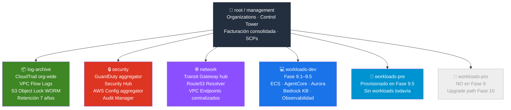
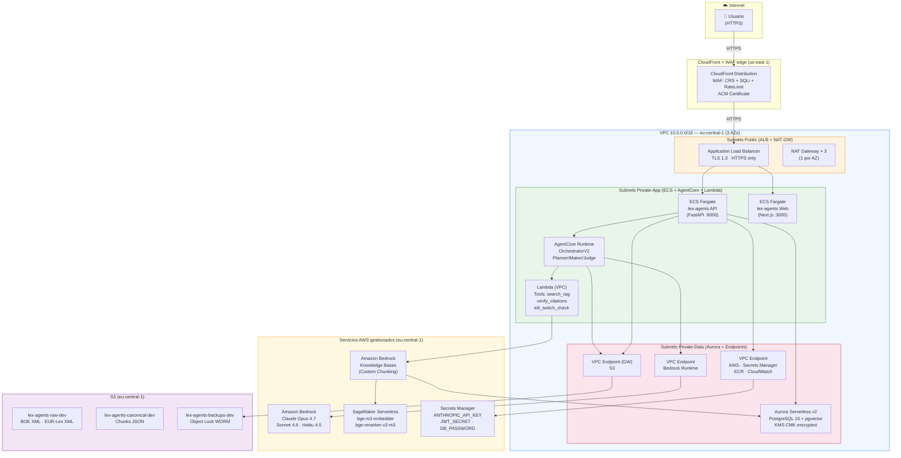
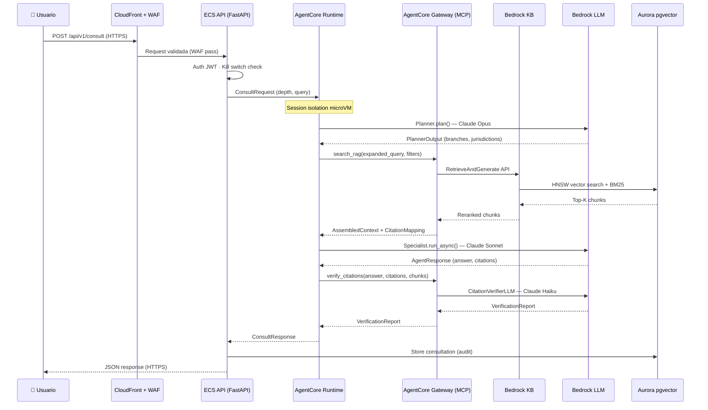
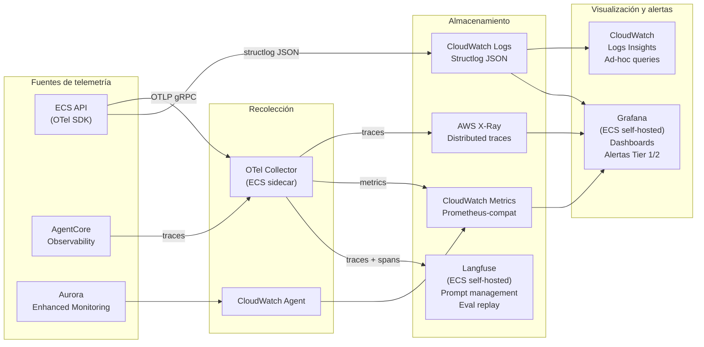
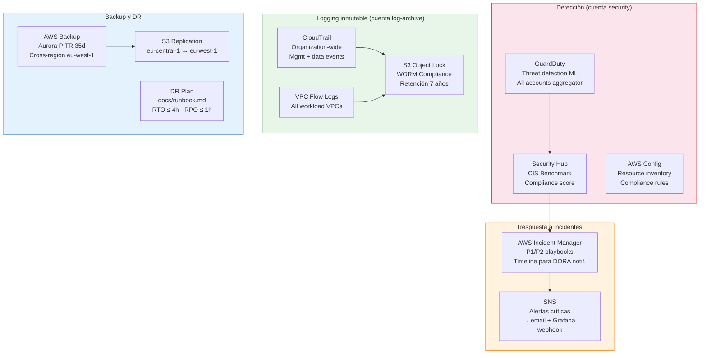

# Arquitectura AWS — lex-agents Fase 9

Diagrama de arquitectura objetivo para el despliegue bancario en AWS.
Región primaria: `eu-central-1` (Frankfurt). Región secundaria: `eu-west-1` (Irlanda).

Ver ADRs 0036–0045 para las decisiones que sustentan cada componente.

---

## 1. AWS Organizations — estructura de cuentas

---

## 2. VPC — topología de red (workloads-dev, eu-central-1)

---

## 3. Flujo de una consulta jurídica (end-to-end)

---

## 4. Flujo de ingesta de documentos legales

```mermaid
flowchart LR
    BOE["BOE XML API\nboe.es"] -->|fetch| DAGSTER
    EURLEX["EUR-Lex Cellar API\nboe.es"] -->|fetch| DAGSTER

    subgraph DAGSTER["Dagster (ECS Fargate)"]
        FETCH["BoeSource.fetch()\nEurLexSource.fetch()"]
        PARSE["parse_to_canonical()\nCanonicalDocument"]
    end

    DAGSTER -->|raw XML| S3RAW["S3: lex-agents-raw-dev"]
    DAGSTER -->|canonical JSON| S3CAN["S3: lex-agents-canonical-dev"]
    S3CAN -->|S3 event| KB_JOB

    subgraph KB_JOB["Bedrock KB Ingestion Job"]
        CUSTOM["Custom Chunking Hook"]
    end

    CUSTOM -->|invoke| LAMBDA

    subgraph LAMBDA["Lambda: LegalChunker"]
        CHUNKER["LegalChunker\n(packages/ingest/)"]
        CTX["Contextualizer\n(Claude Haiku)"]
    end

    LAMBDA -->|chunks + context| EMBED

    subgraph EMBED["SageMaker Serverless"]
        BGE["bge-m3 embedder\n1024-dim dense + sparse"]
    end

    EMBED -->|vectors| AURORA["Aurora pgvector\nlegal_chunks table"]

    style DAGSTER fill:#fff3e0,stroke:#f57c00
    style KB_JOB fill:#e8f5e9,stroke:#388e3c
    style LAMBDA fill:#e3f2fd,stroke:#1565c0
    style EMBED fill:#fce4ec,stroke:#c62828
    style AURORA fill:#f3e5f5,stroke:#7b1fa2
```

---

## 5. Stack de observabilidad

---

## 6. Stack de seguridad y DR

---

## Referencias

| Componente | ADR |
|---|---|
| Regiones y residencia de datos | [ADR 0036](decisions/0036-aws-regions-data-residency.md) |
| Estructura multi-account | [ADR 0037](decisions/0037-aws-multi-account.md) |
| AgentCore Runtime | [ADR 0038](decisions/0038-agentcore-runtime.md) |
| Bedrock como provider LLM | [ADR 0039](decisions/0039-bedrock-llm-provider.md) |
| RAG en AWS (Bedrock KB + Aurora pgvector) | [ADR 0040](decisions/0040-rag-aws-bedrock-kb.md) |
| Networking y seguridad | [ADR 0041](decisions/0041-aws-networking-security.md) |
| Persistencia y estado | [ADR 0042](decisions/0042-aws-persistence.md) |
| CDK deployment strategy | [ADR 0043](decisions/0043-cdk-deployment-strategy.md) |
| DORA controls mapping | [ADR 0044](decisions/0044-dora-controls-mapping.md) |
| Cost model fase inicial | [ADR 0045](decisions/0045-cost-model-fase-inicial.md) |
