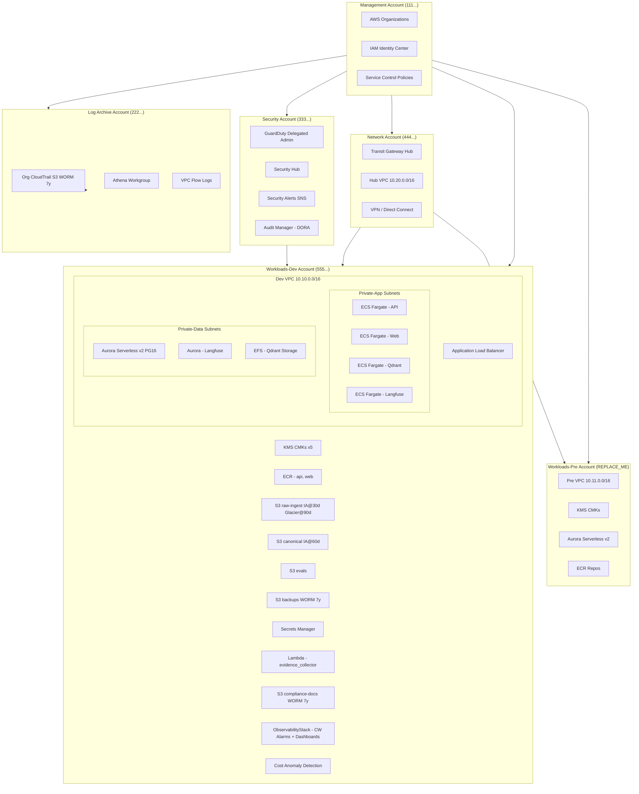
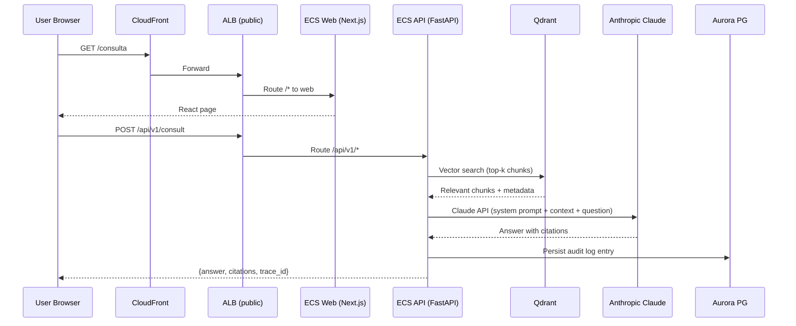
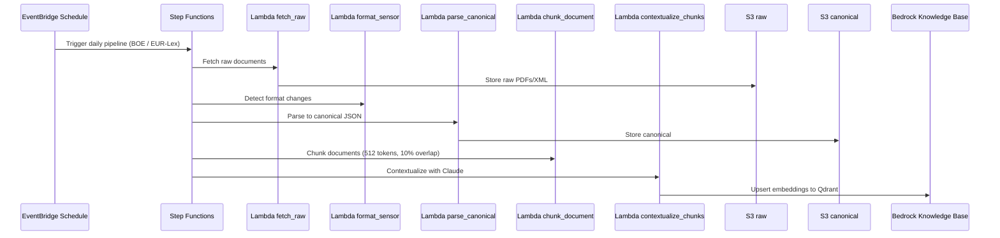
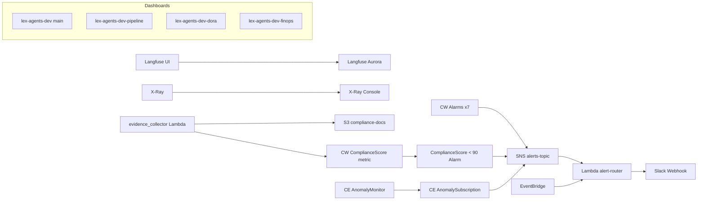

# lex-agents AWS Architecture — Fase 9

## Multi-Account Structure

## Legal Consultation Request Flow

## Document Ingest Flow

## Observability Stack

## Component Summary

| Component | Stack | Region | Purpose |
|-----------|-------|--------|---------|
| Aurora Serverless v2 PG16 | DataStack | eu-west-1 | Application DB with IAM auth |
| S3 raw-ingest | DataStack | eu-west-1 | Raw documents IA@30d, Glacier@90d |
| S3 canonical | DataStack | eu-west-1 | Normalised docs IA@60d |
| S3 backups | DataStack | eu-west-1 | WORM GOVERNANCE 7y, Glacier@30d |
| S3 compliance-docs | ComplianceStack | eu-west-1 | WORM COMPLIANCE 7y, evidence |
| ECS Cluster | AppServicesStack | eu-west-1 | Fargate Spot 75% api+web |
| Qdrant | AppServicesStack | eu-west-1 | Vector store on EFS (FARGATE only) |
| Langfuse | LangfuseStack | eu-west-1 | LLM observability (internal ALB) |
| evidence_collector | ComplianceStack | eu-west-1 | Daily DORA compliance checks |
| Cost Anomaly Monitor | ObservabilityStack | eu-west-1 | Spend anomaly detection |
| Org CloudTrail | LogArchiveStack | eu-west-1 | WORM COMPLIANCE 7y, Glacier@7d |
| GuardDuty | SecurityBaselineStack | eu-west-1 | Threat detection (security acct) |
| Audit Manager | SecurityBaselineStack | eu-west-1 | DORA quarterly assessment |
