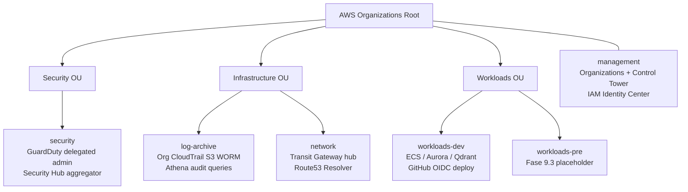
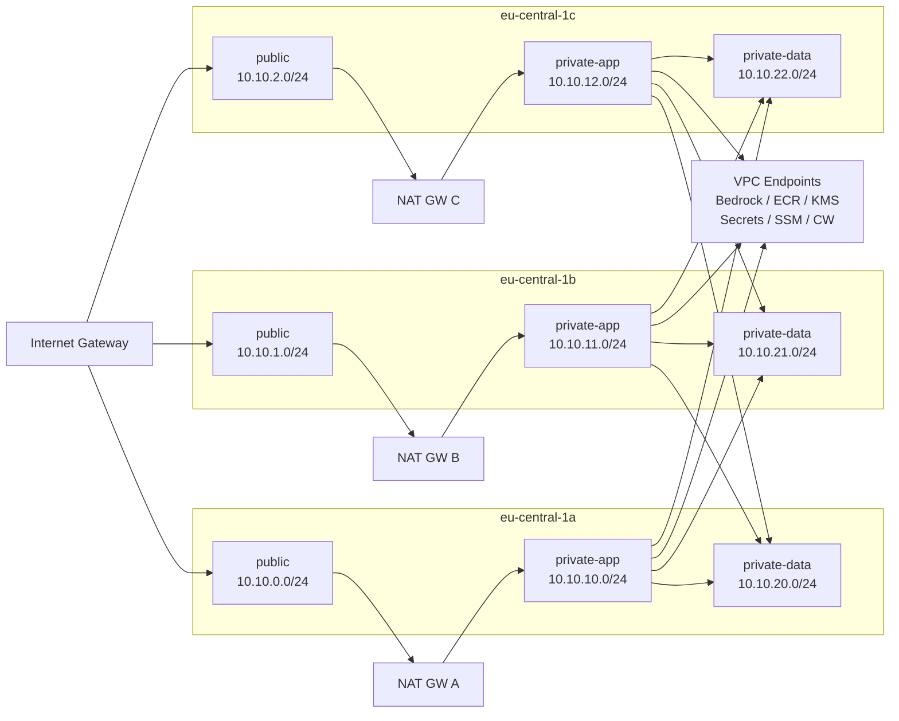

# AWS Foundation — Fase 9.1

Multi-account AWS foundation for lex-agents. Implements DORA-compliant data residency (EU only), strong separation of concerns via AWS Organizations OUs, centralised audit trail, and GitHub Actions OIDC for keyless deployments.

---

## Account structure

Five dedicated accounts under AWS Organizations, grouped into three OUs:



Service Control Policies applied at OU level:

| SCP                        | Applied to OUs                      | Purpose                                               |
| -------------------------- | ----------------------------------- | ----------------------------------------------------- |
| DenyNonEuRegions           | Security, Infrastructure, Workloads | DORA data residency — only eu-central-1 and eu-west-1 |
| DenyRootUsage              | Workloads                           | Prevent root account use without MFA                  |
| DenyUnencryptedStorage     | Workloads                           | Force SSE-KMS on S3 PutObject; deny unencrypted EBS   |
| RequireMFASensitiveActions | Workloads                           | MFA required for IAM/KMS/Org destructive operations   |

---

## Stacks

| Stack name                 | Target account | Purpose                                                            |
| -------------------------- | -------------- | ------------------------------------------------------------------ |
| LexAgents-Organizations    | management     | OUs + 4 SCPs + policy attachments                                  |
| LexAgents-IdentityCenter   | management     | SSO permission sets (Admin, Developer, DataAnalyst, SecurityAudit) |
| LexAgents-LogArchive-Kms   | log-archive    | KMS logs key (CloudTrail, VPC flow logs)                           |
| LexAgents-LogArchive       | log-archive    | Org CloudTrail S3 WORM bucket, Athena workgroup, CW log group      |
| LexAgents-SecurityBaseline | security       | GuardDuty detector, Security Hub, SNS alerts, EventBridge rules    |
| LexAgents-NetworkHub       | network        | Transit Gateway, hub VPC, VPC endpoints, Route53 Resolver inbound  |
| LexAgents-Dev-Kms          | workloads-dev  | KMS keys: logs + rds + s3 + secrets + ebs                          |
| LexAgents-Dev-Network      | workloads-dev  | Spoke VPC (3 AZ × 3 tier), SGs, NACLs, VPC flow logs               |
| LexAgents-Dev-GithubOidc   | workloads-dev  | OIDC provider + scoped deploy role for GitHub Actions              |

---

## Stack deployment order

Dependencies flow top-to-bottom. Stacks on the same level can deploy in parallel.

```
1. LexAgents-Organizations          (management — no dependencies)
2. LexAgents-IdentityCenter         (management — no dependencies)
   LexAgents-LogArchive-Kms         (log-archive — no dependencies)
   LexAgents-SecurityBaseline       (security — no dependencies)
   LexAgents-NetworkHub             (network — no dependencies)
   LexAgents-Dev-Kms                (workloads-dev — no dependencies)
3. LexAgents-LogArchive             (log-archive — needs LogArchive-Kms)
   LexAgents-Dev-Network            (workloads-dev — needs Dev-Kms at runtime, standalone at synth)
   LexAgents-Dev-GithubOidc         (workloads-dev — no stack dependencies)
```

Bootstrap each account before first deploy:

```bash
cdk bootstrap aws://ACCOUNT_ID/eu-central-1 --trust MANAGEMENT_ACCOUNT_ID
```

---

## VPC topology (workloads-dev)

Three availability zones, three subnet tiers, three NAT gateways (one per AZ for HA).



Security group hierarchy:

```
CloudFront (prefix list) → sgAlb (443)
                         → sgEcsWeb (3000) → sgEcsApi (8000)
                                           → sgAurora (5432)
sgAgentcore (egress only) → sgAurora (5432)
                          → VPCE (443)
```

Private-data subnets are additionally protected by a NACL that allows only PostgreSQL (5432) ingress from private-app CIDRs and denies everything else.
