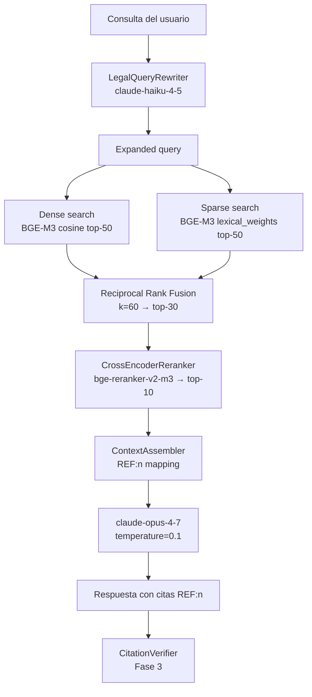

# Pipeline RAG

## Diagrama



## Capa 1: Query rewriting

`LegalQueryRewriter` usa `claude-haiku-4-5-20251001` (temperature=0) para
expandir acrónimos legales antes de la búsqueda:

| Acrónimo | Expansión |
|---|---|
| CRR | Reglamento (UE) n.º 575/2013 |
| CRD IV | Directiva 2013/36/UE |
| CET1 | capital de nivel 1 ordinario |
| MUS | Mecanismo Único de Supervisión |

## Capa 2: Recuperación híbrida

| Parámetro | Valor |
|---|---|
| Modelo embedding | BAAI/bge-m3 |
| Dimensión densa | 1024 |
| Distancia | Cosine |
| k_dense | 50 |
| k_sparse | 50 |
| k_rrf | 30 |
| k (RRF) | 60 |

Fórmula RRF: `score(d) = Σ_{L} 1 / (k + rank(d, L))`

## Capa 3: Reranking

`CrossEncoderReranker` basado en `BAAI/bge-reranker-v2-m3`.
- Input: top-30 de RRF + query
- Output: top-K (por defecto K=10)
- Lazy-load: el modelo (~1.1 GB) se descarga al primer uso en producción
- En tests: `PassthroughReranker` (no descarga el modelo)

## Capa 4: Ensamblaje y generación

`ContextAssembler` formatea cada chunk como:
```
[REF:n]
<hierarchy_path>
<context_text>

<text>
```

`claude-opus-4-7` genera la respuesta usando el prompt `docs/prompts/rag_plain/v1.md`.
Cada afirmación normativa lleva su cita `[REF:n]`.

La verificación de citas a nivel de claim se implementa en Fase 3 (`packages/verifier`).

## Configuración de la colección Qdrant

```python
client.create_collection(
    collection_name="lex_legal_docs",
    vectors_config={
        "dense": VectorParams(size=1024, distance=Distance.COSINE),
    },
    sparse_vectors_config={
        "sparse": SparseVectorParams(index=SparseIndexParams()),
    },
)
```

Campos del payload: todos los campos de `ChunkMetadata` + `text` + `context_text`.

## Filtros disponibles

| Campo | Tipo | Ejemplo |
|---|---|---|
| `jurisdiction` | string | `"EU"` \| `"ES"` |
| `status` | string | `"vigente"` |
| `document_type` | string | `"regulation"` |
| `entry_into_force` | date range | `≤ "2024-01-01"` |

## Métricas de calidad (Fase 4)

Las métricas de evaluación se definen en el skill `eval-runner`. El umbral
de regresión aceptable es <5% en `legal_quality_score`. Ver `docs/evals/`.
